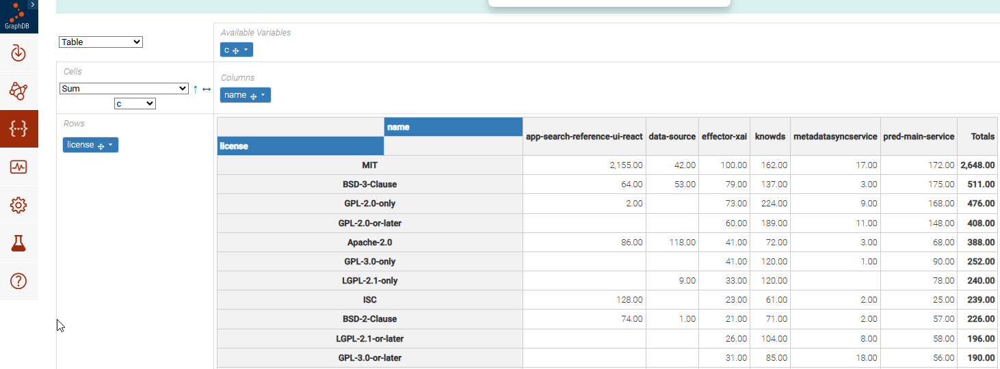
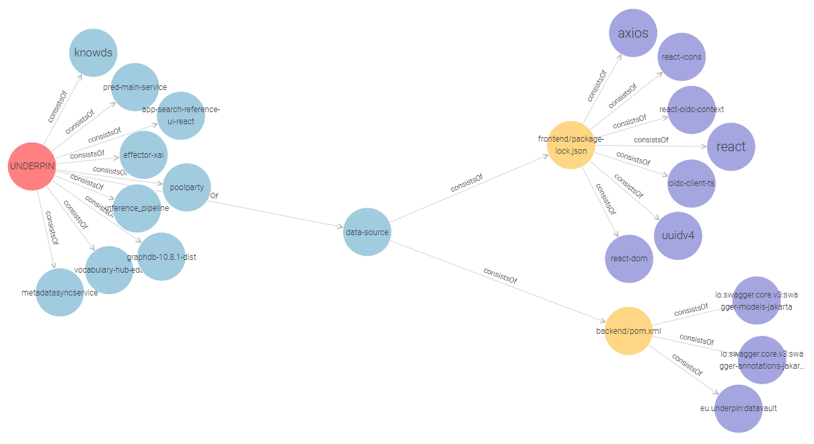

# UNDERPIN Software DPPs

<!-- markdown-toc start - Don't edit this section. Run M-x markdown-toc-refresh-toc -->
**Table of Contents**

- [UNDERPIN Software DPPs](#underpin-software-dpps)
- [UNDERPIN Software DPPs](#underpin-software-dpps-1)
    - [Trivy SPDX 2.3 and Cyclone 1.6 Formats](#trivy-spdx-23-and-cyclone-16-formats)
    - [License Reports](#license-reports)
- [SPDX Tools](#spdx-tools)
- [SPDX Semantic Conversion](#spdx-semantic-conversion)
    - [Makefile](#makefile)
    - [Exploring SPDX RDF](#exploring-spdx-rdf)
    - [SPDX RDF Basic Structure](#spdx-rdf-basic-structure)
- [SPDX Ontology](#spdx-ontology)
- [Sample Queries](#sample-queries)
    - [Explore SPDX Classes and Properties](#explore-spdx-classes-and-properties)
    - [List all softwares](#list-all-softwares)
    - [Softwares with count of packages](#softwares-with-count-of-packages)
    - [List licenses per count](#list-licenses-per-count)
    - [Licenses per Software](#licenses-per-software)
- [Visual Graph Configuration](#visual-graph-configuration)
- [Contributions to SPDX](#contributions-to-spdx)
    - [Modeling of Identifiers](#modeling-of-identifiers)
    - [Reusing Prior Modeling Efforts](#reusing-prior-modeling-efforts)
    - [SHACL Simplification and Rationalization](#shacl-simplification-and-rationalization)
    - [Ontology Realism and Descriptions](#ontology-realism-and-descriptions)
    - [Namespaces](#namespaces)

<!-- markdown-toc end -->

# UNDERPIN Software DPPs
This Github repository includes sofware DPPs for all UNDERPIN sofware components:
- GraphDB: SPDX 2.3 [tag](https://raw.githack.com/underpin-project/dpp/main/GraphDB-spdx-2.3.tag), [json](https://raw.githack.com/underpin-project/dpp/main/GraphDB-spdx-2.3.json), [ttl](https://raw.githack.com/underpin-project/dpp/main/GraphDB-spdx-2.3.ttl); [license](https://raw.githack.com/underpin-project/dpp/main/GraphDB-license-report.txt)
- PoolParty: SPDX 2.3 [tag](https://raw.githack.com/underpin-project/dpp/main/PoolParty-spdx-2.3.tag), [json](https://raw.githack.com/underpin-project/dpp/main/PoolParty-spdx-2.3.json), [ttl](https://raw.githack.com/underpin-project/dpp/main/PoolParty-spdx-2.3.ttl); [license](https://raw.githack.com/underpin-project/dpp/main/PoolParty-license-report.txt)
- datavault: SPDX 2.3 [tag](https://raw.githack.com/underpin-project/dpp/main/datavault-spdx-2.3.tag), [json](https://raw.githack.com/underpin-project/dpp/main/datavault-spdx-2.3.json), [ttl](https://raw.githack.com/underpin-project/dpp/main/datavault-spdx-2.3.ttl)
- effector: SPDX 2.3 [tag](https://raw.githack.com/underpin-project/dpp/main/effector-spdx-2.3.tag), [json](https://raw.githack.com/underpin-project/dpp/main/effector-spdx-2.3.json), [ttl](https://raw.githack.com/underpin-project/dpp/main/effector-spdx-2.3.ttl)
- knowds: SPDX 2.3 [tag](https://raw.githack.com/underpin-project/dpp/main/knowds-spdx-2.3.tag), [json](https://raw.githack.com/underpin-project/dpp/main/knowds-spdx-2.3.json), [ttl](https://raw.githack.com/underpin-project/dpp/main/knowds-spdx-2.3.ttl); [license](https://raw.githack.com/underpin-project/dpp/main/knowds-license-report.txt)
- metadata-sync-service: SPDX 2.3 [tag](https://raw.githack.com/underpin-project/dpp/main/metadata-sync-service-spdx-2.3.tag), [json](https://raw.githack.com/underpin-project/dpp/main/metadata-sync-service-spdx-2.3.json), [ttl](https://raw.githack.com/underpin-project/dpp/main/metadata-sync-service-spdx-2.3.ttl); [license](https://raw.githack.com/underpin-project/dpp/main/metadata-sync-service-license-report.txt)
- predictive-analytics-windfarm: SPDX 2.3 [tag](https://raw.githack.com/underpin-project/dpp/main/predictive-analytics-windfarm-spdx-2.3.tag), [json](https://raw.githack.com/underpin-project/dpp/main/predictive-analytics-windfarm-spdx-2.3.json), [ttl](https://raw.githack.com/underpin-project/dpp/main/predictive-analytics-windfarm-spdx-2.3.ttl); [license](https://raw.githack.com/underpin-project/dpp/main/predictive-analytics-windfarm-license-report.txt); CycloneDX [json](https://raw.githack.com/underpin-project/dpp/main/predictive/analytics-cyclonedx-1.6.json)
- refinery-uc: SPDX 2.3 [tag](https://raw.githack.com/underpin-project/dpp/main/refinery-uc-spdx-2.3.tag), [json](https://raw.githack.com/underpin-project/dpp/main/refinery-uc-spdx-2.3.json), [ttl](https://raw.githack.com/underpin-project/dpp/main/refinery-uc-spdx-2.3.ttl); [license](https://raw.githack.com/underpin-project/dpp/main/refinery-uc-license-report.txt); CycloneDX [json](https://raw.githack.com/underpin-project/dpp/main/refinery-uc-cyclonedx-1.6.json)
- semantic-search: SPDX 2.3 [tag](https://raw.githack.com/underpin-project/dpp/main/semantic-search-spdx-2.3.tag), [json](https://raw.githack.com/underpin-project/dpp/main/semantic-search-spdx-2.3.json), [ttl](https://raw.githack.com/underpin-project/dpp/main/semantic-search-spdx-2.3.ttl); [license](https://raw.githack.com/underpin-project/dpp/main/semantic-search-license-report.txt)
- vocabulary-hub: SPDX 2.3 [tag](https://raw.githack.com/underpin-project/dpp/main/vocabulary-hub-spdx-2.3.tag), [json](https://raw.githack.com/underpin-project/dpp/main/vocabulary-hub-spdx-2.3.json), [ttl](https://raw.githack.com/underpin-project/dpp/main/vocabulary-hub-spdx-2.3.ttl)

The UNDERPIN GraphDB semantic database has a repository `dpp` where this information is loaded and can be explored:
- SPARQL editor: https://graphdb.dataspace.underpinproject.eu/sparql
- SPARQL endpoint: https://graphdb.dataspace.underpinproject.eu/repositories/dpp

See these sections for extra information
- [Sample Queries](#sample-queries) that you can try
- [Visual Graph Configuration](#visual-graph-configuration) where you can explore packages and their dependencies

## Trivy SPDX 2.3 and Cyclone 1.6 Formats

The software DPPs were made using [Trivy](https://trivy.dev/) and use the following formats:
- license-report.txt: license report generated by SPDX
- spdx-2.3.tag: [SPDX 2.3](https://spdx.github.io/spdx-spec/v2.3/) plain text (TAG)
- spdx-2.3.json: [SPDX 2.3](https://spdx.github.io/spdx-spec/v2.3/) JSON
- spdx-2.3.ttl: [SPDX 2.3](https://spdx.github.io/spdx-spec/v2.3/) RDF Turtle (converted with SPDX Tools, see below)
- cyclonedx-1.6.json: [CycloneDX 1.6 JSON](https://cyclonedx.org/docs/1.6/json/)

## License Reports
SPDX has generated License Reports for almost all of the UNDERPIN softwares.
- E.g. below is the license report for GraphDB
- Please note that the semantic query [List licenses per count](#list-licenses-per-count) below shows a flexible way to query this information, eg do counts per license across all softwares.

```
┌────────────────┬──────────┬────────────────────────────────────┬──────────────────────────────────────────────────────────────┐
│ Classification │ Severity │              License               │                        File Location                         │
├────────────────┼──────────┼────────────────────────────────────┼──────────────────────────────────────────────────────────────┤
│ restricted     │ HIGH     │ GPL-2.0                            │ graphdb-10.8.1/doc/THIRD_PARTY_LICENSES.html                 │
│                │          ├────────────────────────────────────┤                                                              │
│                │          │ GPL-2.0-with-classpath-exception   │                                                              │
│                │          ├────────────────────────────────────┤                                                              │
│                │          │ LGPL-2.1                           │                                                              │
│                │          ├────────────────────────────────────┤                                                              │
│                │          │ LGPL-3.0                           │                                                              │
├────────────────┼──────────┼────────────────────────────────────┤                                                              │
│ reciprocal     │ MEDIUM   │ CDDL-1.0                           │                                                              │
│                │          ├────────────────────────────────────┤                                                              │
│                │          │ EPL-1.0                            │                                                              │
│                │          ├────────────────────────────────────┤                                                              │
│                │          │ EPL-2.0                            │                                                              │
├────────────────┼──────────┼────────────────────────────────────┤                                                              │
│ unencumbered   │ LOW      │ CC0-1.0                            │                                                              │
│                │          ├────────────────────────────────────┤                                                              │
│                │          │ Unlicense                          │                                                              │
├────────────────┤          ├────────────────────────────────────┼──────────────────────────────────────────────────────────────┤
│ notice         │          │ Apache-2.0                         │ graphdb-10.8.1/configs/solr-home/collection1/conf/lang/stop- │
│                │          │                                    │ words_en.txt                                                 │
│                │          │                                    ├──────────────────────────────────────────────────────────────┤
│                │          │                                    │ graphdb-10.8.1/configs/solr-home/collection1/conf/protwords- │
│                │          │                                    │ .txt                                                         │
│                │          │                                    ├──────────────────────────────────────────────────────────────┤
│                │          │                                    │ graphdb-10.8.1/configs/solr-home/collection1/conf/stopwords- │
│                │          │                                    │ .txt                                                         │
│                │          │                                    ├──────────────────────────────────────────────────────────────┤
│                │          │                                    │ graphdb-10.8.1/configs/solr-home/collection1/conf/synonyms.- │
│                │          │                                    │ txt                                                          │
│                │          │                                    ├──────────────────────────────────────────────────────────────┤
│                │          │                                    │ graphdb-10.8.1/doc/THIRD_PARTY_LICENSES.html                 │
│                │          ├────────────────────────────────────┤                                                              │
│                │          │ BSD-2-Clause                       │                                                              │
│                │          ├────────────────────────────────────┤                                                              │
│                │          │ BSD-3-Clause                       │                                                              │
│                │          │                                    ├──────────────────────────────────────────────────────────────┤
│                │          │                                    │ graphdb-10.8.1/lib/workbench/14.e4770ab66956f0aae86e.bundle- │
│                │          │                                    │ .js                                                          │
│                │          ├────────────────────────────────────┼──────────────────────────────────────────────────────────────┤
│                │          │ CC-BY-4.0                          │ graphdb-10.8.1/doc/THIRD_PARTY_LICENSES.html                 │
│                │          ├────────────────────────────────────┤                                                              │
│                │          │ ISC                                │                                                              │
│                │          ├────────────────────────────────────┤                                                              │
│                │          │ MIT                                │                                                              │
│                │          ├────────────────────────────────────┤                                                              │
│                │          │ OpenSSL                            │                                                              │
│                │          ├────────────────────────────────────┤                                                              │
│                │          │ Python-2.0                         │                                                              │
├────────────────┼──────────┼────────────────────────────────────┤                                                              │
│ unknown        │ UNKNOWN  │ BSD-0-Clause                       │                                                              │
│                │          │                                    ├──────────────────────────────────────────────────────────────┤
│                │          │                                    │ graphdb-10.8.1/lib/workbench/0.93ef946b5d439221c394.bundle.- │
│                │          │                                    │ js                                                           │
│                │          ├────────────────────────────────────┼──────────────────────────────────────────────────────────────┤
│                │          │ BeOpen                             │ graphdb-10.8.1/doc/THIRD_PARTY_LICENSES.html                 │
│                │          ├────────────────────────────────────┤                                                              │
│                │          │ CNRI-Python-GPL-Compatible         │                                                              │
│                │          ├────────────────────────────────────┤                                                              │
│                │          │ Copyright                          │                                                              │
│                │          ├────────────────────────────────────┤                                                              │
│                │          │ Elastic-2.0                        │                                                              │
│                │          ├────────────────────────────────────┤                                                              │
│                │          │ Entenssa                           │                                                              │
│                │          ├────────────────────────────────────┤                                                              │
│                │          │ GNU-All-permissive-Copying-License │                                                              │
│                │          ├────────────────────────────────────┤                                                              │
│                │          │ ICU                                │                                                              │
│                │          ├────────────────────────────────────┤                                                              │
│                │          │ OFL-1.1                            │                                                              │
│                │          ├────────────────────────────────────┤                                                              │
│                │          │ SSPL-1.0                           │                                                              │
│                │          ├────────────────────────────────────┤                                                              │
│                │          │ unicode_org                        │                                                              │
└────────────────┴──────────┴────────────────────────────────────┴──────────────────────────────────────────────────────────────┘
```

# SPDX Tools

For the operations described below, we use [SPDX tools](https://spdx.dev/use/spdx-tools/):
- For trials and low-volume conversions we can use the [SPDX OnLine Tools](https://tools.spdx.org/app/)
- For automated conversion we used the [SPDX Java Libraries and Tools](https://github.com/spdx/tools-java), [release 2.0.2](https://github.com/spdx/tools-java/releases/tag/v2.0.2) of Oct 2025
  - Unzip `tools-java-2.0.2-jar-with-dependencies.jar` (and optionally add it to your jarpath)
  - Windows: make a batch file `spdx.bat` like this (or a similar shell script on Linux):
```cmd
@echo off
java -jar c:\prog\bin\tools-java-2.0.2-jar-with-dependencies.jar %*
```

The first thing we'll try is verification:
```
spdx Verify semantic-search-spdx-2.3.json > semantic-search-spdx-2.3-err.txt
```
This returns 920 lines of errors (730kB), all of which seem to be due to an incomplete download location (doesn't specify the host):
```
Invalid download location git+app-search-reference-ui-react. 
```

# SPDX Semantic Conversion
We want to convert SPDX to RDF (a knowledge graph) so that we can use SPARQL queries and KG visualization (VizGraph).

SPDX 3.0.1 has a [Semantic Serialization](https://spdx.github.io/spdx-spec/v3.0.1/serializations/). 
It is based on a JSON-LD mapping of the SPDX terms.
Although it is not officially specified for SPDX 2.3, we can use the SPDX `Convert` tool to convert even older 
- Run `spdx Convert --help` for command-line help
- The tool supports the following input/output formats: `JSON, XLS, XLSX, TAG, RDFXML, RDFTTL, YAML, XML JSONLD`
- Normally it recognizes the format from the input/output file name. 
  However, it doesn't recognize `.ttl` (see [spdx/tools-java#252](https://github.com/spdx/tools-java/issues/252)) so we have to provide the input/output formats explicitly

## Makefile
The [Makefile](Makefile) has some neat logic to convert all SPDX files (TAG and JSON) to TTL while preferring TAG:
```make
TAG         = $(wildcard *spdx*.tag)
TAG_AS_JSON = $(TAG:%.tag=%.json)
JSON        = $(filter-out $(TAG_AS_JSON), $(wildcard *spdx*.json))
TTL         = $(TAG:%.tag=%.ttl) $(JSON:%.json=%.ttl)

all: $(TTL)

%.ttl: %.tag
	spdx Convert $^ $@ TAG RDFTTL

%.ttl: %.json
	spdx Convert $^ $@ JSON RDFTTL
```
- The variable `TAG_AS_JSON` takes all `.tag` filenames but renames them to `.json`
- The variable `JSON` takes all `*spdx*.json` files but filters out those that have `.tag` counterparts
- Finally, the variable `TTL` is a union of all `TAG` and `JSON` files, where both extensions are renamed to `.ttl`

To debug this logic, we can run `make echo` to see the names of all input and output files:
```make
echo:
	@echo $(TAG)
	@echo $(JSON)
	@echo $(TTL)
```

Running `make` does the actual conversion:
```
spdx Convert effector-spdx-2.3.tag effector-spdx-2.3.ttl TAG RDFTTL
spdx Convert knowds-spdx-2.3.tag knowds-spdx-2.3.ttl TAG RDFTTL
spdx Convert metadata-sync-service-spdx-2.3.tag metadata-sync-service-spdx-2.3.ttl TAG RDFTTL
spdx Convert predictive-analytics-windfarm-spdx-2.3.tag predictive-analytics-windfarm-spdx-2.3.ttl TAG RDFTTL
spdx Convert refinery-uc-spdx-2.3.tag refinery-uc-spdx-2.3.ttl TAG RDFTTL
spdx Convert datavault-spdx-2.3.json datavault-spdx-2.3.ttl JSON RDFTTL
spdx Convert semantic-search-spdx-2.3.json semantic-search-spdx-2.3.ttl JSON RDFTTL
spdx Convert vocabulary-hub-spdx-2.3.json vocabulary-hub-spdx-2.3.ttl JSON RDFTTL
```

## Exploring SPDX RDF

SPDX describes packages, their licenses and dependencies.
See query [Explore SPDX Classes and Properties](#explore-spdx-classes-and-properties) for an exploration based on SPARQL.
But below we perform a simpler exploration based on files.

In addition to the root package, most UNDERPIN software uses a bunch of subsidiary (library) packages:
```
$ grep -c spdx:Package *.ttl
datavault-spdx-2.3.ttl:232
effector-spdx-2.3.ttl:445
knowds-spdx-2.3.ttl:605
metadata-sync-service-spdx-2.3.ttl:352
predictive-analytics-windfarm-spdx-2.3.ttl:913
refinery-uc-spdx-2.3.ttl:1
semantic-search-spdx-2.3.ttl:2626
vocabulary-hub-spdx-2.3.ttl:1
```
So how do we find the root packages?

- They are described in the sole `SpdxDocument` per SPDX file:
```
$ grep -c spdx:SpdxDocument *.ttl
datavault-spdx-2.3.ttl:1
effector-spdx-2.3.ttl:1
knowds-spdx-2.3.ttl:1
metadata-sync-service-spdx-2.3.ttl:1
predictive-analytics-windfarm-spdx-2.3.ttl:1
refinery-uc-spdx-2.3.ttl:1
semantic-search-spdx-2.3.ttl:1
vocabulary-hub-spdx-2.3.ttl:1
```
- Also, root packages are the only ones that have `spdx:primaryPackagePurpose spdx:purpose_source`

Here is a count of all relation types appearing in our SPDX.
```
grep -h spdx:relationshipType *.ttl|perl -pe 's{ +}{ }g'|sort|uniq -c
   1417  spdx:relationshipType spdx:relationshipType_contains
   9529  spdx:relationshipType spdx:relationshipType_dependsOn
      8  spdx:relationshipType spdx:relationshipType_describes
```
- As you see in the turtle example below,  the root relation is `SpdxDocument - describes - Package`.
  This is confirmed by the count: there's exactly one per file
- There are also relations between packages: `contains` and `dependsOn` (we treat them the same)

## SPDX RDF Basic Structure
The structure of the simplest SPDX of UNDERPIN software is like this:
```ttl
BASE <http://trivy.dev/repository/vocabulary-hub-edc-8c610de9-1a27-4c7e-be99-a5f2c6547ddb#>
PREFIX doap: <http://usefulinc.com/ns/doap#>
PREFIX ptr:  <http://www.w3.org/2009/pointers#>
PREFIX rdfs: <http://www.w3.org/2000/01/rdf-schema#>
PREFIX spdx: <http://spdx.org/rdf/terms#>
PREFIX xsd:  <http://www.w3.org/2001/XMLSchema#>

<SPDXRef-DOCUMENT>
        a                  spdx:SpdxDocument;
        spdx:creationInfo  [ a             spdx:CreationInfo;
                             spdx:created  "2025-10-21T10:21:04Z";
                             spdx:creator  "Tool: trivy-0.65.0" , "Organization: aquasecurity"
                           ];
        spdx:dataLicense   <http://spdx.org/licenses/CC0-1.0>;
        spdx:name          "vocabulary-hub-edc";
        spdx:relationship  [ a                        spdx:Relationship;
                             spdx:relatedSpdxElement  <SPDXRef-Repository-2967ac88b3b67da3>;
                             spdx:relationshipType    spdx:relationshipType_describes
                           ];
        spdx:specVersion   "SPDX-2.3" .

<SPDXRef-Repository-2967ac88b3b67da3>
        a                           spdx:Package;
        spdx:annotation             [ a                    spdx:Annotation;
                                      rdfs:comment         "SchemaVersion: 2";
                                      spdx:annotationDate  "2025-10-21T10:21:04Z";
                                      spdx:annotationType  spdx:annotationType_other;
                                      spdx:annotator       "Tool: trivy-0.65.0"
                                    ];
        spdx:downloadLocation       "git+vocabulary-hub-edc";
        spdx:filesAnalyzed          false;
        spdx:name                   "vocabulary-hub-edc";
        spdx:primaryPackagePurpose  spdx:purpose_source .

<http://spdx.org/licenses/CC0-1.0>
        a                             spdx:ListedLicense;
        rdfs:seeAlso                  "https://creativecommons.org/publicdomain/zero/1.0/legalcode";
        spdx:crossRef                 [ a                   spdx:CrossRef;
                                        spdx:isLive         true;
                                        spdx:isValid        true;
                                        spdx:isWayBackLink  false;
                                        spdx:match          "true";
                                        spdx:order          "0"^^xsd:int;
                                        spdx:timestamp      "2025-07-01T14:58:05Z";
                                        spdx:url            "https://creativecommons.org/publicdomain/zero/1.0/legalcode"
                                      ];
        spdx:isDeprecatedLicenseId    false;
        spdx:isFsfLibre               true;
        spdx:isOsiApproved            false;
        spdx:licenseId                "CC0-1.0";
        spdx:licenseName              "Creative Commons Zero v1.0 Universal";
        spdx:licenseText              "Creative Commons Legal Code\n\n...";
        spdx:licenseTextHtml          "\n      <div class=\"optional-license-text\">...";
        spdx:name                     "Creative Commons Zero v1.0 Universal";
        spdx:standardLicenseTemplate  "<<beginOptional>><<beginOptional>>Creative Commons...".
```

# SPDX Ontology
The [SPDX 3.0.1 ontology](https://spdx.org/rdf/3.0.1/spdx-model.ttl) describes SPDX terms and includes SHACL shapes for validating SPDX data.
However, it doesn't fit our purposes since the data model has changed too much from 2.3 to 3.0.1
- Namespace is versioned, eg
```ttl
@prefix ns1: <https://spdx.org/rdf/3.0.1/terms/Core/> .
```
- Namespace is broken up into sub-namespaces: `Core, Security, Sofware, AI, ExpandedLicensing`
  (`spdx:` itself is used only for the ontology record).
  Eg `SpdxDocument, Relationship, RelationshipType` live in `Core` but `Package` lives in `Software`.
- Relationship representation has changed from this:

```ttl
<source> spdx:relationship 
  [a spdx:Relationship;
   spdx:relatedSpdxElement <target>;
   spdx:relationshipType spdx:relationshipType_foo]
```

To this:

```ttl
[] a spdx:Relationship;
   spdx:from <source>;
   spdx:to <target>;
   spdx:relationshipType <Core/RelationshipType/foo>]
```

So for now we don't load and use an ontology.
In the future we may retrofit a SPDX 2.3 ontology by "downgrading" the 3.0.1 ontology.

# Sample Queries
For easier loading, we concat all individual SPDX files to `ALL-spdx-2.3.zip`.
Then we load them to GraphDB's `dpp` repository.

## Explore SPDX Classes and Properties
`SPDX-terms` is a basic exploration of classes and properties:
```sparql
select ?x (count(*) as ?c) {
  {[] a ?x}
  union {[] ?x []}
} group by ?x order by ?x
```
- The `dpp` database uses 78 SPDX terms: 16 classes and 62 properties.
- The key classes and props are commented below
- The main classes are Package and Relationship.
  - As you see from the numbers, our softwares use a pretty huge numbers of subsidiary packages (libraries).
  - The reason the number of Relations is 2.5x bigger is that the same package can be used several times through several paths

| ?x                                 |    ?c | comment                                    |
|------------------------------------|-------|--------------------------------------------|
| spdx:Annotation                    |  5715 |                                            |
| spdx:Checksum                      |  3998 |                                            |
| spdx:ConjunctiveLicenseSet         |  1396 |                                            |
| spdx:CreationInfo                  |    10 |                                            |
| spdx:CrossRef                      |   309 |                                            |
| spdx:DisjunctiveLicenseSet         |    34 |                                            |
| spdx:ExternalRef                   |  7630 |                                            |
| spdx:ExtractedLicensingInfo        |   547 | License info extracted from a file         |
| spdx:File                          |  2978 |                                            |
| spdx:ListedLicense                 |    54 |                                            |
| spdx:ListedLicenseException        |     4 |                                            |
| spdx:Package                       |  7648 | Software, manifest, library                |
| spdx:PackageVerificationCode       |  3691 |                                            |
| spdx:Relationship                  | 17118 | Relation between two packages              |
| spdx:SpdxDocument                  |    10 |                                            |
| spdx:WithExceptionOperator         |   100 |                                            |
| spdx:algorithm                     |  3998 |                                            |
| spdx:annotation                    |  5715 |                                            |
| spdx:annotationDate                |  5715 |                                            |
| spdx:annotationType                |  5715 |                                            |
| spdx:annotator                     |  5715 |                                            |
| spdx:checksum                      |  3998 |                                            |
| spdx:checksumValue                 |  3998 |                                            |
| spdx:created                       |    10 |                                            |
| spdx:creationInfo                  |    10 |                                            |
| spdx:creator                       |    20 |                                            |
| spdx:crossRef                      |   309 |                                            |
| spdx:dataLicense                   |    10 |                                            |
| spdx:deprecatedVersion             |     1 |                                            |
| spdx:downloadLocation              |  7648 |                                            |
| spdx:exceptionTextHtml             |     4 |                                            |
| spdx:externalRef                   |  7630 |                                            |
| spdx:extractedText                 |   547 |                                            |
| spdx:fileName                      |  2978 |                                            |
| spdx:filesAnalyzed                 |  3957 |                                            |
| spdx:hasExtractedLicensingInfo     |   546 |                                            |
| spdx:isDeprecatedLicenseId         |    58 |                                            |
| spdx:isFsfLibre                    |    38 |                                            |
| spdx:isLive                        |   309 |                                            |
| spdx:isOsiApproved                 |    54 |                                            |
| spdx:isValid                       |   309 |                                            |
| spdx:isWayBackLink                 |   309 |                                            |
| spdx:licenseConcluded              |  7629 | License listed with a package              |
| spdx:licenseDeclared               |  7629 | License listed with a package              |
| spdx:licenseException              |   100 |                                            |
| spdx:licenseExceptionId            |     4 |                                            |
| spdx:licenseExceptionTemplate      |     4 |                                            |
| spdx:licenseExceptionText          |     4 |                                            |
| spdx:licenseId                     |   601 | Identifier for listed license              |
| spdx:licenseName                   |    54 |                                            |
| spdx:licenseText                   |    54 |                                            |
| spdx:licenseTextHtml               |    54 |                                            |
| spdx:match                         |   309 |                                            |
| spdx:member                        | 11532 | Member licenses of a ConjunctiveLicenseSet |
| spdx:name                          |  8262 | Name of package or extracted license       |
| spdx:order                         |   309 |                                            |
| spdx:packageVerificationCode       |  3691 |                                            |
| spdx:packageVerificationCodeValue  |  3691 |                                            |
| spdx:primaryPackagePurpose         |  7648 |                                            |
| spdx:referenceCategory             |  7630 |                                            |
| spdx:referenceLocator              |  7630 |                                            |
| spdx:referenceType                 |  7630 |                                            |
| spdx:relatedSpdxElement            | 17118 | Target package of a relation               |
| spdx:relationship                  | 17118 | Relation between 2 packages                |
| spdx:relationshipType              | 17118 | 2 kinds that we treat the same             |
| spdx:sourceInfo                    |  3939 |                                            |
| spdx:specVersion                   |    10 |                                            |
| spdx:standardLicenseHeader         |    22 |                                            |
| spdx:standardLicenseHeaderHtml     |    22 |                                            |
| spdx:standardLicenseHeaderTemplate |    22 |                                            |
| spdx:standardLicenseTemplate       |    54 |                                            |
| spdx:supplier                      |  7630 |                                            |
| spdx:timestamp                     |   309 |                                            |
| spdx:url                           |   309 |                                            |
| spdx:versionInfo                   |  7632 |                                            |
| rdf:type                           | 51242 |                                            |
| rdfs:comment                       |  5777 |                                            |
| rdfs:seeAlso                       |    98 |                                            |

## List all softwares
`DPP-softwares` returns the root packages with name, download location
- Cleans up the name by removing some prefixes and suffixes
```sparql
select ?root ?name ?download {
  ?doc a spdx:SpdxDocument;
     spdx:relationship [spdx:relationshipType spdx:relationshipType_describes; spdx:relatedSpdxElement ?root].
  ?root spdx:name ?name1.
  bind(replace(replace(?name1,"usr/local/lib/python.*/site-packages/(.*)/METADATA","$1"),
      "^C:/Users/nkape/|^urn:|/opt/|tomcat/webapps/PoolParty/WEB-INF/lib/|app/app.jar/BOOT-INF/lib/|.tar.gz$|.tar$|.jar$","") as ?name)
  optional {?root spdx:downloadLocation ?download}
}
```

## Softwares with count of packages
`DPP-package-count` returns all sofwares with a count of packages they contain or depend on.
The is an indication of the complexity of the software:
```sparql
PREFIX spdx: <http://spdx.org/rdf/terms#>
select ?name (count(distinct ?pkg) as ?c) {
  [] spdx:relationshipType spdx:relationshipType_describes; spdx:relatedSpdxElement ?root.
  ?root spdx:name ?name1;
    (spdx:relationship/spdx:relatedSpdxElement)+ ?pkg
  bind(replace(replace(?name1,"usr/local/lib/python.*/site-packages/(.*)/METADATA","$1"),
      "^C:/Users/nkape/|^urn:|/opt/|tomcat/webapps/PoolParty/WEB-INF/lib/|app/app.jar/BOOT-INF/lib/|.tar.gz$|.tar$|.jar$","") as ?name)
} group by ?root ?name order by desc(?c)
```
- The query relies on the fact that out of the root, all relations are either `contains` or `dependsOn`, so we can disregard the relation type
- On the other hand, it's common for a low-level package to be included multiple times through different packages, 
  so we don't just count the number of relations and we take `distinct ?pkg`.

| name                          |    c |
|-------------------------------|------|
| poolparty                     | 4242 |
| app-search-reference-ui-react | 2625 |
| graphdb-10.8.1-dist           | 1215 |
| pred-main-service             |  912 |
| knowds                        |  604 |
| effector-xai                  |  444 |
| metadatasyncservice           |  343 |
| data-source                   |  231 |

## List licenses per count
`DPP-license-count` shows all open source licenses used by UNDERPIN software in descending order of number of uses.
It takes care of some peculiarities:
- "Conjunctive" licenses are represented as a blank nodes where `spdx:member` lists the constituent licenses
- `ExtractedLicensingInfo` doesn't bind to a formal license URL with `licenseId`, but we can use `name` that is well-structured
```sparql
PREFIX spdx: <http://spdx.org/rdf/terms#>
select ?license (count(*) as ?c) {
  ?x spdx:licenseDeclared/spdx:member? ?lic .
  optional {?lic spdx:name ?name}
  optional {?lic spdx:licenseId ?id}
  filter(?lic != spdx:noassertion && (!bound(?name) || ?name!="NOASSERTION") && !isBlank(?lic))
  bind(if(exists{?lic a spdx:ExtractedLicensingInfo},?name,?id) as ?license)
} group by ?license order by desc(?c)
```
There are 324 unique license strings. Here are the top 15 or so:
| license           |    c |
|-------------------|------|
| MIT               | 2648 |
| BSD-3-Clause      |  511 |
| GPL-2.0-only      |  476 |
| GPL-2.0-or-later  |  408 |
| Apache-2.0        |  388 |
| GPL-3.0-only      |  252 |
| LGPL-2.1-only     |  240 |
| ISC               |  239 |
| BSD-2-Clause      |  226 |
| LGPL-2.1-or-later |  196 |
| GPL-3.0-or-later  |  190 |
| LGPL-2.0-or-later |  168 |
| CC0-1.0           |  158 |
| LGPL-2.0-only     |  142 |
| LGPL-3.0-only     |  141 |
| LGPL-3.0-or-later |  134 |
| public-domain     |  133 |

## Licenses per Software
`DPP-license-per-software` counts number of licenses per UNDERPIN software:
```sparql
PREFIX spdx: <http://spdx.org/rdf/terms#>
select ?name ?license (count(*) as ?c) {
 ?doc a spdx:SpdxDocument;
     spdx:relationship [spdx:relationshipType spdx:relationshipType_describes; spdx:relatedSpdxElement ?root].
  ?root spdx:name ?name1; (spdx:relationship/spdx:relatedSpdxElement)+ ?package.
  bind(replace(replace(?name1,"usr/local/lib/python.*/site-packages/(.*)/METADATA","$1"),
      "^C:/Users/nkape/|^urn:|/opt/|tomcat/webapps/PoolParty/WEB-INF/lib/|app/app.jar/BOOT-INF/lib/|.tar.gz$|.tar$|.jar$","") as ?name)
  ?package spdx:licenseDeclared/spdx:member? ?lic .
  optional {?lic spdx:name ?licName}
  optional {?lic spdx:licenseId ?licId}
  filter(?lic != spdx:noassertion && (!bound(?name) || ?licName!="NOASSERTION") && !isBlank(?lic))
  bind(if(exists{?lic a spdx:ExtractedLicensingInfo},?licName,?licId) as ?license)
} group by ?name ?license order by desc(?c)
```
The result is a 2-dimensional table of numbers that is best presented as a pivot table in GraphDB Workbench:



# Visual Graph Configuration
Graph config DPP: "Root packages; expand them to show dependencies".

Starting point:
- Makes a "synthetic" central node `UNDERPIN` and attaches all root software packages to it using a "synthetic" property `consistsOf`:
```sparql
PREFIX spdx: <http://spdx.org/rdf/terms#>
construct {<urn:UNDERPIN> spdx:consistsOf ?root}
where {
  ?root spdx:primaryPackagePurpose spdx:purpose_source
}
```
Graph expansion:
```sparql
PREFIX spdx: <http://spdx.org/rdf/terms#>
construct {?node spdx:dependsOn ?package}
where {
  ?node spdx:relationship / spdx:relatedSpdxElement ?package 
}
```
Node basics:
- Finds a node name using 3 alternatives (`name, fileName` or the node's URI)
- Cleans up the name by removing prefixes (related to folders etc) and suffixes like `.tar.gz, .tar, .jar`
```sparql
PREFIX spdx: <http://spdx.org/rdf/terms#>
select * {
  optional {?node spdx:name|spdx:fileName ?name}
  optional {?node spdx:primaryPackagePurpose ?type}
  bind(coalesce(?name,str(?node)) as ?name1)
    bind(replace(replace(?name1,"usr/local/lib/python.*/site-packages/(.*)/METADATA","$1"),
      "^C:/Users/nkape/|^urn:|/opt/|tomcat/webapps/PoolParty/WEB-INF/lib/|app/app.jar/BOOT-INF/lib/|.tar.gz$|.tar$|.jar$","") as ?label)
}
```

For example, here is a saved graph [DPP-dataSource](https://graphdb.dataspace.underpinproject.eu/graphs-visualizations?saved=d7c4bd58e1c54d81aa413541ef63af4b) that shows the constituent modules of the `data-source` software (which consists of two modules: frontend and backend):



# Contributions to SPDX
We have made multiple contributions to the SPDX ontology and data model through Github issues, discussions and participation in WG meetings.

## Modeling of Identifiers
[#1157 merge ExternalIdentifier and ExternalRef and add details](https://github.com/spdx/spdx-3-model/issues/1157).
- SPDX uses two clases `ExternalIdentifier` and `ExternalRef` but the difference between them is not clear enough, so they better be merged
- We also propose to associate multiple URLs (`identifierLocator`) to be associated with one identifier, and give several examples where this is used:
  - Wikidata "formatter URLs" and their varieties (eg "third-party formatter URL" or "formatter URL for RDF resource")
  - GS1 Digital Links that can resolve an identifier to about 100 kinds of content ([link types](https://ref.gs1.org/voc/?show=linktypes))
  - Company registers (UK CompanyHouse, NO BRC) that can serve HTML pages and RDF per company, with content negotiation
- Add extra details about `IdentifierTypes`, including
 - `appliesTo` (kind of entity)
 - `regex` (format of the identifier)
 - `issuingAuthority`
 - `webResource`: multiple templated web URLs with `contentType` and their own `issuingAuthority`, e.g.:
```ttl
<id/cve> a :IdentifierType;
  :appliesTo :Vulnerability;
  :issuingAuthority <https://cve.org>; 
  :regex "^CVE-\d{4}-\d{4}$";
  :webResource 
    [:locatorTemplate "https://www.cve.org/CVERecord?id={}"; :contentType "text/html";        :issuingAuthority <https://cve.org>  ],
    [:locatorTemplate "https://nvd.nist.gov/vuln/detail/{}"; :contentType "text/html";        :issuingAuthority <https://nist.gov/>],
    [:locatorTemplate "https://cveawg.mitre.org/api/cve/{}"; :contentType "application/json"; :issuingAuthority <https://mitre.org>].
```
- Representing indentifiers about identifiers, such as GLEI Registration authorities List (RAL), https://org-id.guide and Wikidata. E.g.:
```ttl
<id/org-id> a :IdentifierType;
  :name "Org-ID guide";
  :appliesTo :IdentifierType; # recursive!
  :issuingAuthority <https://org-id.guide/>;
  :regex "^[A-Z]{2}-[A-Z]+$";
  :webResource
    [:locatorTemplate "https://org-id.guide/list/$1"; :contentType "text/html"].
<id/glei/ral> a :IdentifierType;
  :name "GLEI Registration Authorities List";
  :appliesTo IdentifierType; # recursive!
  :issuingAuthority <https://www.gleif.org>;
  :webLink <https://www.gleif.org/en/about-lei/code-lists/gleif-registration-authorities-list>;
  :regex "^RA-\\d{6}$";
  :webResource
    [:locatorTemplate "https://search.gleif.org/#/search/simpleSearch=$1"; :contentType "text/html";
      :comment "Returns a list of LEI registrations coming from that register"].
```
- Splitting an id and reinserting different parts in different places in the URL.
  - We use parentheses in `regex` and then `$1, $2...` in `locatorTemplate`
  - Eg check https://ec.europa.eu/taxation_customs/vies/rest-api/ms/BG/vat/200356710 which is the VIES record of Ontotext
```ttl
<id/vat/eu> a IdentifierType;
  appliesTo Organization;
  regex "^([A-Z]{2})(.+)$";
  webResource
    [locatorTemplate "https://ec.europa.eu/taxation_customs/vies/rest-api/ms/$1/vat/$2"; contentType "application/json"; 
      issuingAuthority <https://ec.europa.eu/taxation_customs/vies>].
```

## Reusing Prior Modeling Efforts
- [#1155 consider Reuse](https://github.com/spdx/spdx-3-model/issues/1155)
- [#1149 use QUDT instead of defining your own units](https://github.com/spdx/spdx-3-model/issues/1149)

SPDX started as a model to describe software packages and their dependencies.
But it is expanding in all sort of directions. 
It will be useful to consider prior initiatives and reuse as much as possible from their data models/ontologies:
- To save time and effort
- To improve the chances of SPDX penetration and reach

The issue touches upon the following areas:
- Units of Measure and Quantity Kinds: QUDT
- Geometries: WGS for simple points or GeoSPARQL for complex geometries
- Hardware DPP aspects (eg supply chain): RePlanIT
- DPPs in general: UNTP
- Cybersecurity: STIX/TAXII and cybersec KGs
- Datasets: DCAT, DCAT-AP, schema.org `Dataset`, DPROD
- AI: MLDCAT-AP, Croissant, MLSO, LPWC

We also referenced an earlier work:
Vladimir Alexiev and Svetla Boytcheva,
[Semantization of Machine Learning and Data Science (a Project Idea)](https://docs.google.com/presentation/d/1_8LSXa9vVzNwPE6Hjj4cKIJNRRBNz2wP/edit). 
Presentation at Big Dava Value Association Activity Group 45 (BDVA AG 45), Sep 2021.

Scope:
- Problem: Data Science, AI & ML are expensive, and that's one of the reasons why relatively few enterprises use them.
- Goal: rationalize and industrialize DS efforts, and make them more reproducible and reusable.
- Approach: capture a lot of semantic info about all DS processes in an enterprise, and thus enable automation, discovery, reusability.
    
The kinds of data we'd like to represent and integrate semantically (part of it is similar to what you can see on the Kaggle and OpenML sites): 
- Business context: goals, motivations, data value, value chain, cost vs benefit analysis, SWOT analysis...
- DS challenges, where do they come from, datasets that can be leveraged to solve them 
- DS staff, expertise, projects, tasks, risks 
- DS/ML algorithms, implementations, modules, dependencies, software projects, versions, issue trackers 
- Cloud and IT resources: compute, storage; their deployment, management, automation...
- ML model deployment, performance, model drift, retraining...

Established software genres that cover parts of this landscape: 
- ModelOps (devOps for ML), Feature Spaces 
- Enterprise data catalogs (data hubs) vs data marketplaces vs open data catalogs vs EU Data Spaces and their metadata 
- FAIR data, reproducible research, Research Objects, research workflows, 

We've researched over 100 relevant ontologies that can be leveraged, covering 
- Organizations/enterprises, business plans, 
- Ontologies, semantic data, 
- DS challenges, datasets, statistical data, quality assessment 
- DS/ML approaches, software, projects, issues, 
- Data on research/science 
- Project management 

Focusing on DS/ML approaches only, a couple of the relevant ontologies or standards are: 
- PMML (predictive modeling markup language) 
- e-LICO, DMEX ontologies for describing DS 
- OntoDM, KDO ontologies for describing DS

## SHACL Simplification and Rationalization
SPDX uses SHACL shapes for validation, which are generated from a Markdown description of the model.
Various things in SHACL can be simplified or should be changed:

- [#1156 SHACL: sh:not on classes (abstract class check)](https://github.com/spdx/spdx-3-model/issues/1156)
  - Uses `sh:not` to assert that resources must not have abstract types like `:ElementCollection`
  - But this conflicts with repositories that actually implement `rdfs:subClassOf` Reasoning; 
    and SHACL relies on such reasoning though it doesn't mandate it
  - The suggestion is to use a positive check by either:
    - Enumerating concrete classes in `sh:in` or `sh:or`
    - Or using SHACL-SPARQL and a property path `rdf:type/rdfs:subClassOf+`
- [#1154 SHACL: modularize prop shapes](https://github.com/spdx/spdx-3-model/issues/1154)
  Many classes use the same property in the same way, which leads to repetitions like this:
```ttl
ns2:ExternalRef a owl:Class,         sh:NodeShape ;
    sh:property [ sh:datatype xsd:string ;
            sh:maxCount 1 ;
            sh:nodeKind sh:Literal ;
            sh:path ns2:contentType ;
            sh:pattern "^[^\\/]+\\/[^\\/]+$" ].
ns2:Annotation a owl:Class,         sh:NodeShape ;
    sh:property 
        [ sh:datatype xsd:string ;
            sh:maxCount 1 ;
            sh:nodeKind sh:Literal ;
            sh:path ns2:contentType ;
            sh:pattern "^[^\\/]+\\/[^\\/]+$" ] .
```
This can be simplified significantly by modularizing it: defining a `sh:PropertyShape` with explicit URL:
```ttl
ns2:ExternalRef a owl:Class,         sh:NodeShape ;
    sh:property ns2:contentType_Property.
ns2:Annotation a owl:Class,         sh:NodeShape ;
    sh:property ns2:contentType_Property.
ns2:contentType_Property a sh:PropertyShape;
            sh:datatype xsd:string ;
            sh:maxCount 1 ;
            sh:nodeKind sh:Literal ;
            sh:path ns2:contentType ;
            sh:pattern "^[^\\/]+\\/[^\\/]+$" .
```
- [#1153 simplify SHACL: patterns](https://github.com/spdx/spdx-3-model/issues/1153):
  Slash doesn't need to be escaped in `sh:pattern`
  - So this `"^[^\\/]+\\/[^\\/]+$"`
  - Can be simplified to this `"^[^/]+/[^/]+$"`
- [#1152 simplify SHACL shapes (sh:nodeKind)](https://github.com/spdx/spdx-3-model/issues/1152)
  The shapes include many checks that are superfluous or can be simplified:
  - `sh:nodeKind sh:BlankNodeOrIRI` is superfluous with `owl:Class, sh:NodeShape`
  - `sh:nodeKind sh:BlankNodeOrIRI` is superfluous with `sh:class`
  - `sh:nodeKind sh:Literal` is superfluous with sh:datatype
  - `sh:nodeKind sh:IRI` is superfluous with `sh:in` listing an enumeration of IRIs
  - It is more economical to use `sh:class` instead of such enumeration of IRIs (assuming that SPDX enumerations are closed)

## Ontology Realism and Descriptions
- [#1151 "other" enum values considered useless](https://github.com/spdx/spdx-3-model/issues/1151)
- [#1150 remove parasitic words from ontology classes](https://github.com/spdx/spdx-3-model/issues/1150)
- [#1148 remove parasitic words from descriptions, be more specific](https://github.com/spdx/spdx-3-model/issues/1148)
- [#1147 Use semantic linebreaks in descriptions (was: bad breaks)](https://github.com/spdx/spdx-3-model/issues/1147)

## Namespaces
[#1146 namespace problems in spdx-model.ttl](https://github.com/spdx/spdx-3-model/issues/1146)

The issue raises several issues that have been discussed before and there is a good chance 
- SPDX uses auto-generated prefixes (and for some sub-namespaces, not even any prefixes):
```ttl
@prefix ns1: <https://spdx.org/rdf/3.0.1/terms/Core/> .
@prefix ns2: <https://spdx.org/rdf/3.1/terms/Core/> .
@prefix ns3: <https://spdx.org/rdf/3.1/terms/Dataset/> .
@prefix ns4: <https://spdx.org/rdf/3.1/terms/Security/> .
@prefix ns5: <https://spdx.org/rdf/3.1/terms/ExpandedLicensing/> .
@prefix ns6: <https://spdx.org/rdf/3.1/terms/Service/> .
@prefix ns7: <https://spdx.org/rdf/3.1/terms/AI/> .
@prefix ns8: <https://spdx.org/rdf/3.1/terms/SupplyChain/> .
@prefix ns9: <https://spdx.org/rdf/3.1/terms/Software/> .
@prefix ns10: <https://spdx.org/rdf/3.1/terms/Hardware/> .
<https://spdx.org/rdf/3.1/terms/Extension/>
<https://spdx.org/rdf/3.1/terms/Build/>
```
- The namespaces are versioned, which makes them unstable and contravenes the simple principle "COOLURIs don't change".
- It's simpler to use a single flat namespace rather than sub-namespaces per topic.
  - SPDX is not such a huge ontology to require splitting into sub-namespaces.
  - SPDX uses plain words as keys in JSONLD, so there is some coordination process between modules to ensure no conflicts.
    That is an indication to switch to a flat namespace.

